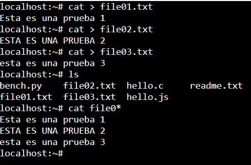
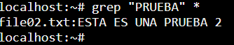
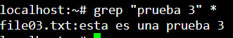
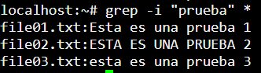
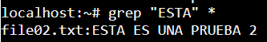
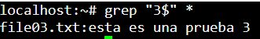

# Ejercicio 1 Regexp - Andrei George Mira

## 1.1 - ¿Qué son las expresiones regulares?
Las expresiones regulares, basicamente sirven para poder buscar un valor concreto y de esa manera poder
trabajar con ese valor que deseamos y hacer lo que necesitemos. Es como un filro para buscar, donde le podemos
assignar rangos u otros metodos para buscar lo 

## 1.2 - Explica brevemente para que sirven las expresiones regulares
Como ya he comentado anteriormente, sirve como una especie de filtro/vaidador de datos en funccion de lo que 
se utilize. Con el podemos hacer busquedas de unos valores concretos que necesitemos o validar
campos para ver si cumplen con las condiciones que nosotros especifiquemos

## 1.3 - Ejercicio 3:

### a. Desde la interfaz de comandos de UNIX, realiza los siguientes 3 ficheros:

- **file01.txt** **→** Esta es una prueba 1
- **file02.txt** **→** ESTA ES UNA PRUEBA 2
- **file03.txt** **→** esta es una prueba 3

### b. Haz una búsqueda con grep para visualizar los ficheros que contengan el siguiente texto **“PRUEBA”** en la que deberá aparecer solamente el fichero **file02.txt**

### c. Haz una búsqueda con grep del siguiente texto **“prueba 3”** en la que deberá aparecer solamente el fichero  **file03.txt**

### d. Haz una búsqueda con grep del siguiente texto **“prueba”** que sea **case-insensitive** en la que deberán aparecer los ficheros **file01.txt**, **file02.txt** y **file03.txt**

### e. Haz una búsqueda con grep que muestre solamente los ficheros que empiecen por **“ESTA”**. La búsqueda deberá devolver solamente el fichero **file02.txt**

### f. Haz una búsqueda con grep que muestre solamente los ficheros que acaban con un **“3”**. La búsqueda deberá devolver solamente el fichero **file03.txt**

## 1.4 - ¿Qué es un motor de expresiones regulares? ¿Para que sirven?
Son programas o bibliotecas que tienen en su codigo la capacidad de detectar o interpretar un regexp
detectando su sintaxis o marcando un campo especificando que vamos a utilizar regexp. Sirven para poder
hacer regexp y asi buscar/remplazar datos en un fichero

## 1.5 - ¿Cuáles son los principales motores de expresiones regulares? ¿Cuál vamos a utilizar nosotr@s?
- Oniguruma
- Java (java.util.regexp)
- JavaScript (Regexp)
- GNU Grep (grep)
- PCRE (Perl Compatible Regular Expressions)
- PHP (PCRE)
- Ruby (Regexp)
- C# (.NET Regex)
- Python (re)

En mi caso, Visual Studio Code utiliza Oniguruma

## 1.6 - ¿Qué es un patrón? ¿Y un match?
Un patron, es una secuencia de caracteres de todo tipo que marcan una condicion o repeticion. En el caso del match, 
seria las coinicidencias que se consiguen a partir de un patron, todo lo que cumpla con el patron, sera un match

## 1.7 - Saca el esquema del siguiente patrón ^Hola$ y, además, explica que hace dicha expresión regular sobre el siguiente documento

Basicamente, el patron de **^Hola$**, nos indica que tiene que empezar y acabar con la palabra **Hola**

Sobre este documento, solo hari match con la primera linea, es decir, la que tiene la palabra Hola ya que es la unica 
que cumple la condicion de que empieze y acabe con Hola, las demas no se cumplen ya que si que empiezan con Hola pero 
acaban con otra cosa y no entra dentro del pattern que estamos buscando

- Hola
- Hola ¿Qué tal?
- Hola y adiós
